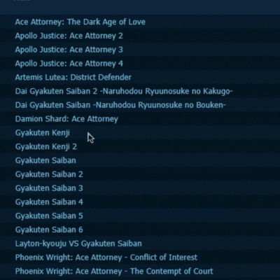

# VNDB Mod Extension Chrome

## Instalar sin empaquetar

> 1. Ir a la sección de extensiones (chrome://extensions/), (vivaldi://extensions/)...
> 2. Activa el modo desarrollador
> 3. Hacer click en cargar descomprimida
> 4. Selecciona el directorio del proyecto

## Previews

